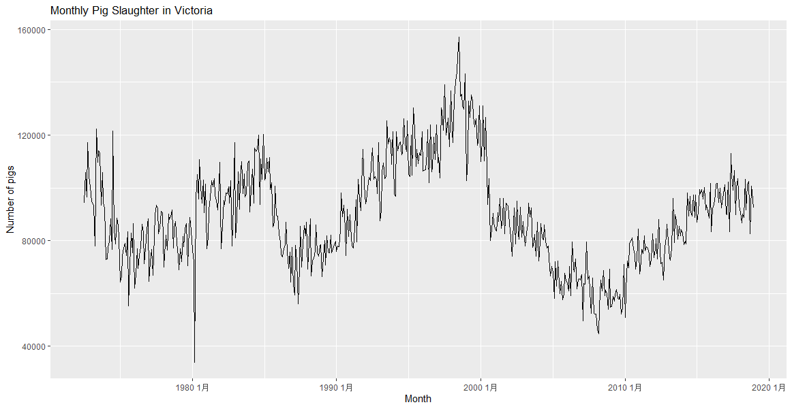
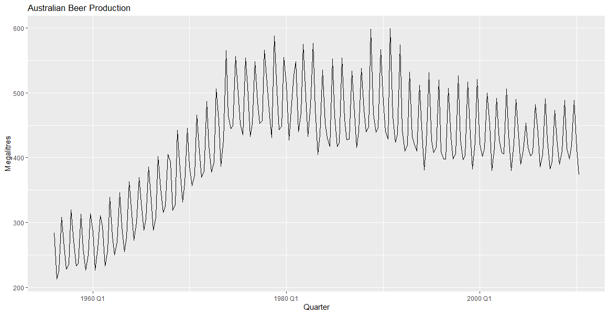
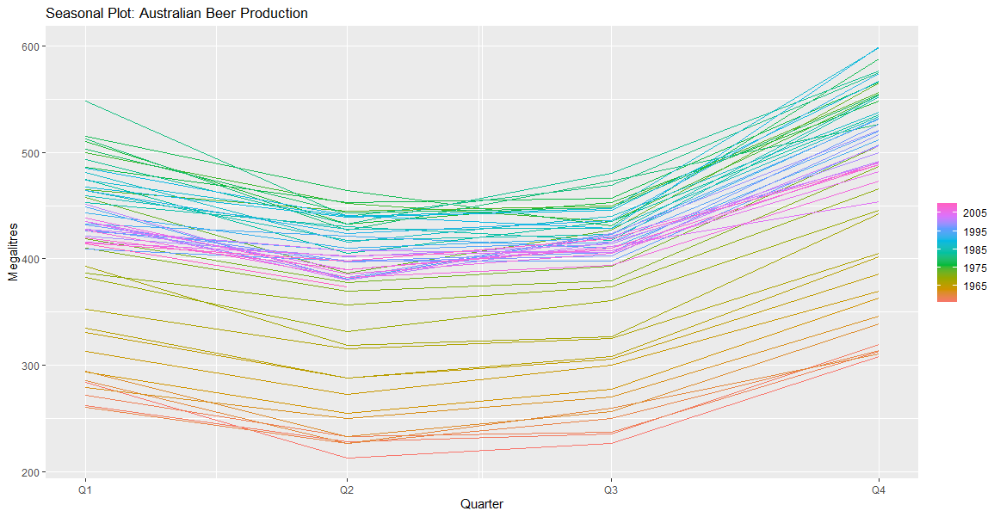
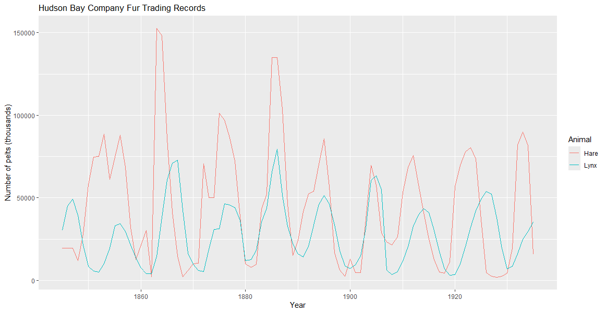

## Set up

1.  Make sure you have the following installed on your system: $\text{\LaTeX}$, R4.2.2+, RStudio 2023.12+, and Quarto 1.3.450+.
2.  Clone the course [repo](https://github.com/yanshuotan/st5209-2026).
3.  Create a separate folder in the root directory of the repo, label it with your name, e.g. `yanshuo-assignments`
4.  Copy the assignment1.qmd file over to this directory.
5.  Modify the duplicated document with your solutions, writing all R code as code chunks.
6.  When running code, make sure your working directory is set to be the folder with your assignment .qmd file, e.g. `yanshuo-assignments`. This is to ensure that all file paths are valid.[^1]

[^1]: You may view and set the working directory using `getwd()` and `setwd()`.

## Submission

1.  Render the document to get a .pdf printout.
2.  Submit both the .qmd and .pdf files to Canvas.

```{r echo=FALSE, message=FALSE, warning=FALSE}
library(tidyverse)
library(fpp3)
# Set graphics device to support Unicode characters
options(device = function(...) {
  grDevices::png(..., type = "cairo")
})
```

## Question 1 (Quarto)

Read the [guide](https://quarto.org/docs/computations/r.html) on using Quarto with R and answer the following questions:

a)  Write a code chunk that imports `tidyverse` and `fpp3`.
b)  Modify the chunk so that only the following output is shown (i.e. the usual output about attaching packages and conflicts is not shown.)

c)  Modify the chunk so that it is executed but no code is shown at all when rendered to a pdf.
d)  Modify the document so that your name is printed on it beneath the title.


## Question 2 (Livestock)

Consider the `aus_livestock` dataset loaded in the `fpp3` package.

a)  Use `filter()` to extract a time series comprising the monthly total number of pigs slaughtered in Victoria, Australia, from Jul 1972 to Dec 2018.

```{r}
vic_pigs <- aus_livestock |>
  filter(Animal == "Pigs", 
         State == "Victoria",
         Month >= yearmonth("1972 Jul"),
         Month <= yearmonth("2018 Dec"))
```

b)  Make a time plot of the resulting time series.

```{r}
vic_pigs |>
  autoplot(Count) +
  labs(title = "Monthly Pig Slaughter in Victoria",
       y = "Number of pigs",
       x = "Month")
```



## Question 3 (Beer production)

Consider the `aus_production` dataset loaded in the `fpp3` package. We will study the column measuring the production of beer.

a)  Make a time plot of the beer production time series.

```{r}
aus_production |>
  autoplot(Beer) +
  labs(title = "Australian Beer Production",
       y = "Megalitres",
       x = "Quarter")
```



b)  Describe the observed trend.

Beer production increased steadily until its peak around 1979, then declined gradually.
Strong seasonality is evident, with higher production in summer and lower in winter.
Seasonal fluctuations remain consistent over time.

c)  Make a seasonal plot.

```{r}
aus_production |>
  gg_season(Beer) +
  labs(title = "Seasonal Plot: Australian Beer Production",
       y = "Megalitres")
```



d)  What is the period of the seasonality?

The period of seasonality is 4 quarters (1 year), as the data is quarterly.

e)  Describe the seasonal behavior.

Beer production peaks in Q4 (October–December), corresponding to the summer season in Australia.
Production drops significantly in Q1 and Q2 (January–June), reaching the lowest point.
A strong, recurring seasonal pattern is observed, with production rising steadily in Q3 (July–September).

## Question 4 (Pelts)

Consider the `pelt` dataset loaded in the `fpp3` package, which measures the Hudson Bay Company trading records for Snowshoe Hare and Canadian Lynx furs from 1845 to 1935.

a)  Plot both time series on the same axes. *Hint: Use `pivot_longer()` to create a key column*.

```{r}
pelt |>
  pivot_longer(cols = c(Hare, Lynx), 
               names_to = "Animal", 
               values_to = "Count") |>
  autoplot(Count) +
  labs(title = "Hudson Bay Company Fur Trading Records",
       y = "Number of pelts (thousands)",
       x = "Year",
       color = "Animal")
```



b)  What happens when you try to use `gg_season()` to the lynx fur time series? What is producing the error?

```{r}
#| error: true
pelt |>
  gg_season(Lynx)
```

Error in `gg_season()`:
! The data must contain at least one observation per seasonal period.

The error occurs because `gg_season()` requires a seasonal time series with a defined seasonal period (e.g., monthly or quarterly data). The `pelt` dataset is annual data (yearly observations from 1845 to 1935), which has no within-year seasonality to plot. The time index shows it's measured in years with only one observation per year, so there are no sub-year seasonal patterns (like quarters or months) to visualize.

c)  Make a lag plot with the first 20 lags. Which lags display strong positive correlation? Which lags display strong negative correlation? Verify this with the time plot.

```{r}
pelt |>
  gg_lag(Lynx, lags = 1:20, geom = "point") +
  labs(title = "Lag Plot: Lynx Pelts")
```

Strong positive correlation appears at lags around 10 years (specifically lags 9-11), suggesting a cyclical pattern with approximately 10-year periods. Strong negative correlation appears at lags around 5 years (lags 4-6), which represents the opposite phase of the cycle. This can be verified in the time plot, which shows cyclical peaks occurring roughly every 10 years.

d)  If you were to guess the seasonality period based on the lag plot, what would it be?

Based on the lag plot showing strong positive correlation around lag 10, the period would be approximately 10 years.

e)  Use the provided function `gg_custom_season()` in `_code/plot_util.R`[^2] to make a seasonal plot for lynx furs with the period that you guessed.[^3] Does the resulting plot suggest seasonality? Why or why not?

```{r}
source("../_code/plot_util.R")
pelt |>
  gg_custom_season(Lynx, period = 10) +
  labs(title = "Custom Seasonal Plot: Lynx Pelts (10-year period)")
```

The resulting plot does not strongly suggest true seasonality. While there is a cyclical pattern with roughly 10-year periods, this is a natural population cycle rather than calendar-based seasonality. The cycles are not perfectly regular (they vary in length and amplitude), and the pattern is driven by predator-prey dynamics rather than seasonal factors like weather or calendar effects.

[^2]: You can load this function using `source("../_code/plot.util.R")`.

[^3]: Unfortunately, it seems \``gg_season()` does not allow this functionality.

## Question 5 (Box-Cox, Q3.3 in FPP)

Why is the Box-Cox transform unhelpful for the `canadian_gas` data?

```{r}
canadian_gas |>
  autoplot(Volume) +
  labs(title = "Canadian Gas Production",
       y = "Billion cubic meters",
       x = "Month")
```
```{r}
canadian_gas |>
  features(Volume, features = guerrero)
```
   lambda_guerrero
            <dbl>
1           0.577
```{r}
canadian_gas |>
  autoplot(box_cox(Volume, lambda = "auto")) +
  labs(title = "Box-Cox Transformed Canadian Gas Production",
       y = "Transformed Volume")
```

Error in `geom_line()`:
! Problem while computing aesthetics.
ℹ Error occurred in the 1st layer.
Caused by error in `abs(x[!lambda_0])^lambda[!lambda_0]`:
! non-numeric argument to binary operator

The Box-Cox transform is unhelpful for the `canadian_gas` data for the following reasons:

1. Data contains zero or negative values: As shown by the error message above, the Box-Cox transformation fails because the dataset contains non-positive values. The transformation requires strictly positive data when λ ≠ 0（λ = 0.577）.

2. Mathematical incompatibility: The Box-Cox transformation formula $y^{(\lambda)} = \frac{y^\lambda - 1}{\lambda}$ (when λ ≠ 0) is undefined for y ≤ 0. Even attempting to apply the transformation with the Guerrero-suggested λ = 0.577 results in a "non-numeric argument" error.

3. No variance stabilization needed: Examining the time plot shows that while gas production has increased over time, the seasonal variation pattern is relatively consistent and doesn't exhibit strong heteroscedasticity that would require a variance-stabilizing transformation.

In summary, the presence of zero or negative values in the data makes the Box-Cox transformation mathematically impossible to apply.

## Question 6 (Decomposition with outliers, Q3.7 in FPP)

Consider the last five years of the Gas data from `aus_production` .

```{r}
gas <- tail(aus_production, 5*4) |> select(Gas)
```

a.  Plot the time series. Can you identify seasonal fluctuations and/or a trend-cycle?

```{r}
gas |>
  autoplot(Gas) +
  labs(title = "Gas Production (Last 5 Years)",
       y = "Production",
       x = "Quarter")
```

Yes, the time series shows clear seasonal fluctuations with a regular pattern repeating every year. There is also a visible upward trend-cycle, with gas production increasing over the 5-year period.

b.  Use `classical_decomposition` with `type=multiplicative` to calculate the trend-cycle and seasonal indices.

```{r}
gas |>
  model(classical_decomposition(Gas, type = "multiplicative")) |>
  components() |>
  autoplot() +
  labs(title = "Classical Multiplicative Decomposition of Gas Production")
```

c.  Do the results support the graphical interpretation from part a?

```{r}
gas |>
  model(classical_decomposition(Gas, type = "multiplicative")) |>
  components()
```

Yes, the decomposition results strongly support the graphical interpretation from part a:
1. Trend component: Shows a clear upward trend, increasing from approximately 200 in 2006 Q1 to 226 in 2009 Q4. This confirms the upward trend-cycle observed in the time plot.
2. Seasonal component: Displays a consistent quarterly pattern with seasonal indices of approximately:
   - Q1: 0.875 (lowest - summer in Australia, low heating demand)
   - Q2: 1.07 (higher - autumn)
   - Q3: 1.13 (highest - winter, peak heating demand)
   - Q4: 0.925 (lower - spring)
   This regular pattern confirms the seasonal fluctuations observed in part a.
3. Random component: The random values are close to 1 (ranging from approximately 0.974 to 1.02), indicating small irregular fluctuations. This confirms that the multiplicative model captures the trend and seasonality well, with minimal unexplained variation.

d.  Compute and plot the seasonally adjusted data.

```{r}
gas |>
  model(classical_decomposition(Gas, type = "multiplicative")) |>
  components() |>
  autoplot(season_adjust) +
  labs(title = "Seasonally Adjusted Gas Production",
       y = "Seasonally Adjusted Production",
       x = "Quarter")
```
The seasonally adjusted data removes the seasonal fluctuations, making the upward trend more visible and easier to interpret.

e.  Change one observation to be an outlier by running the following snippet:

```{r}
gas_outlier <- gas |>
  mutate(Gas = if_else(Quarter == yearquarter("2007Q4"), Gas + 300, Gas))
```

Recompute the decomposition. What is the effect of the outlier on the seasonally adjusted data?

```{r}
gas_outlier |>
  model(classical_decomposition(Gas, type = "multiplicative")) |>
  components() |>
  autoplot() +
  labs(title = "Decomposition with Outlier at 2007Q4")
```

```{r}
gas_outlier |>
  model(classical_decomposition(Gas, type = "multiplicative")) |>
  components() |>
  autoplot(season_adjust) +
  labs(title = "Seasonally Adjusted Gas Production (with Outlier)",
       y = "Seasonally Adjusted Production",
       x = "Quarter")
```

The outlier at 2007Q4 significantly affects the decomposition. The trend-cycle estimate is distorted around the outlier point, creating artificial bumps before and after the outlier. The seasonally adjusted data shows a large spike at 2007Q4, and the outlier also affects the seasonal indices estimation, particularly for Q4. The classical decomposition method is not robust to outliers.

f.  Does it make any difference if the outlier is near the end rather than in the middle of the time series?

```{r}
gas_outlier_end <- gas |>
  mutate(Gas = if_else(Quarter == yearquarter("2010Q1"), Gas + 300, Gas))
```

```{r}
gas_outlier_end |>
  model(classical_decomposition(Gas, type = "multiplicative")) |>
  components() |>
  autoplot() +
  labs(title = "Decomposition with Outlier at 2010Q1 (Near End)")
```

```{r}
gas_outlier_end |>
  model(classical_decomposition(Gas, type = "multiplicative")) |>
  components() |>
  autoplot(season_adjust) +
  labs(title = "Seasonally Adjusted Gas Production (Outlier Near End)",
       y = "Seasonally Adjusted Production",
       x = "Quarter")
```

Yes, it makes a difference. When the outlier is near the end of the series (2010Q1), the distortion to the trend is less severe because there are fewer observations after the outlier for the moving average to smooth. The trend shows a bump but cannot recover as much as when the outlier is in the middle. The impact on seasonal indices is also different, as there are fewer complete years after the outlier to average out its effect.

## Question 7 (STL decomposition, Q3.10 in FPP)

Consider the `canadian_gas` dataset.

a.  Do an STL decomposition of the data.

```{r}
canadian_gas |>
  model(STL(Volume)) |>
  components() |>
  autoplot() +
  labs(title = "STL Decomposition of Canadian Gas Production")
```

The STL decomposition successfully separates the Canadian gas production data into trend, seasonal, and remainder components. The trend shows a strong upward movement over time. The seasonal component displays a regular yearly pattern, and the remainder captures the irregular fluctuations.

b.  How does the seasonal shape change over time? \[Hint: Try plotting the seasonal component using `gg_season()`.\]

```{r}
canadian_gas |>
  model(STL(Volume)) |>
  components() |>
  gg_season(season_year) +
  labs(title = "Seasonal Component Over Time",
       y = "Seasonal component",
       x = "Month")
```

The seasonal plot shows that the seasonal shape changes significantly over time. Earlier years (e.g., 1960s-1970s) show different seasonal patterns compared to later years. The amplitude and shape of the seasonal component evolve, with more pronounced peaks and troughs in recent decades. This indicates that the seasonal pattern is not constant but has changed as gas production and consumption patterns have evolved.

c.  Apply a calendar adjustment and compute the STL decomposition again. What is the effect on the seasonal shape?

```{r}
canadian_gas |>
  mutate(Volume_adjusted = Volume / days_in_month(Month) * mean(days_in_month(Month))) |>
  model(STL(Volume_adjusted)) |>
  components() |>
  autoplot() +
  labs(title = "STL Decomposition with Calendar Adjustment")
```

```{r}
canadian_gas |>
  mutate(Volume_adjusted = Volume / days_in_month(Month) * mean(days_in_month(Month))) |>
  model(STL(Volume_adjusted)) |>
  components() |>
  gg_season(season_year) +
  labs(title = "Seasonal Component Over Time (Calendar Adjusted)",
       y = "Seasonal component",
       x = "Month")
```

The calendar adjustment normalizes the data by the number of days in each month, removing the variation caused by months having different lengths. After the adjustment, the seasonal component becomes smoother and more regular. The effect is particularly noticeable for February (which has fewer days) and for months with 31 days. The seasonal pattern is now more clearly attributable to true seasonal effects (like weather and heating demand) rather than calendar effects.
